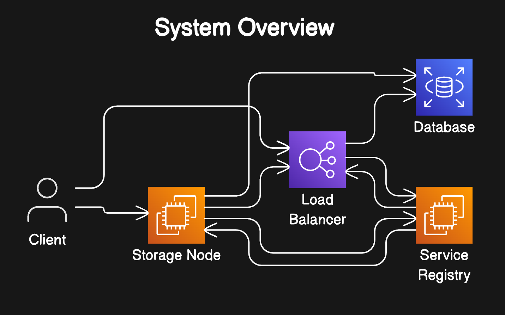
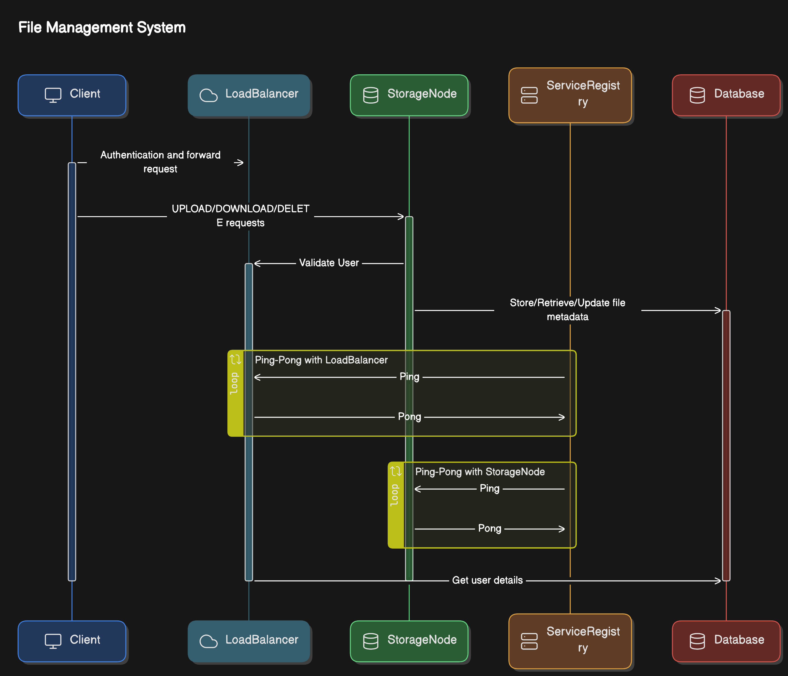
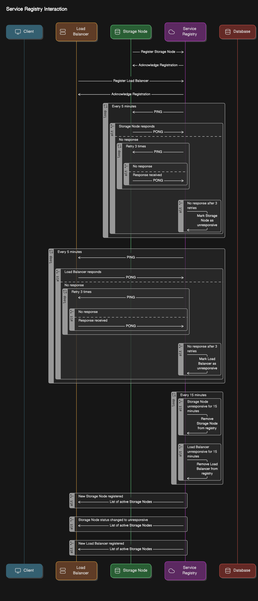
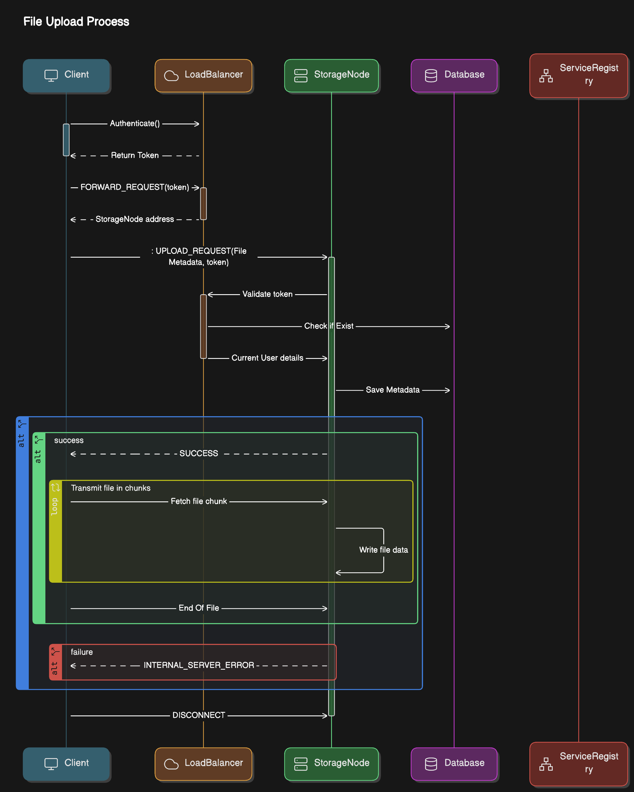
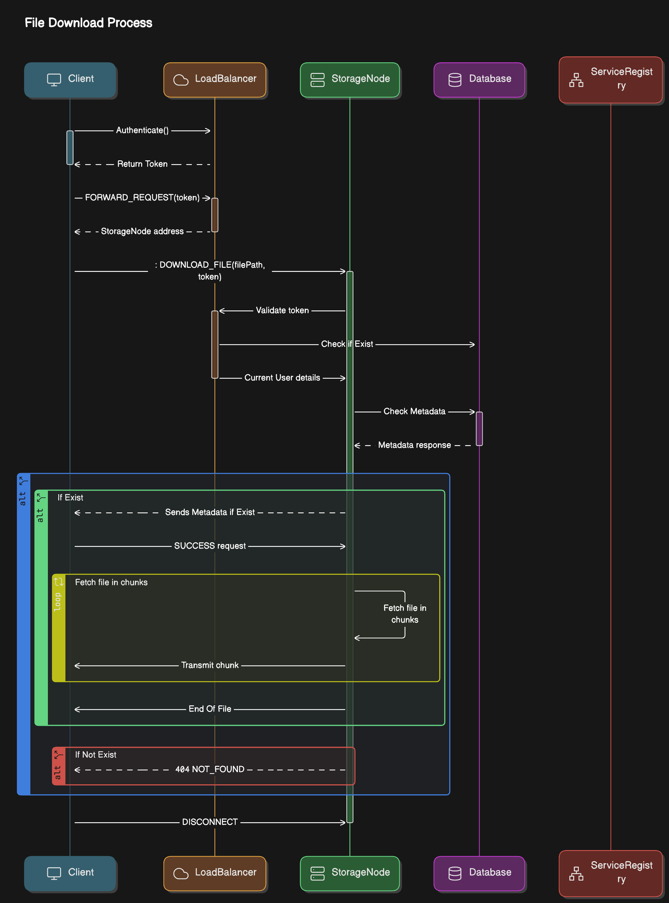
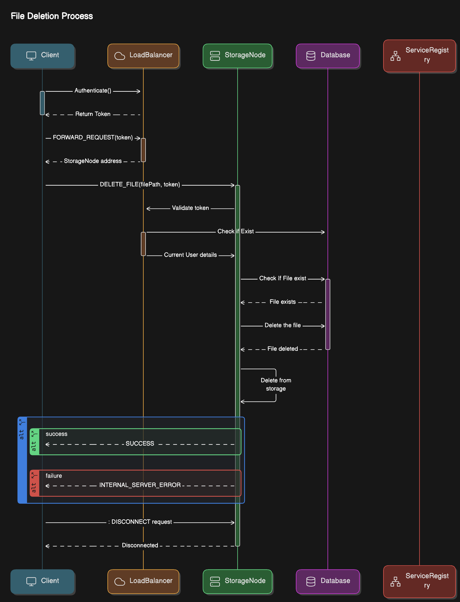

# 🌩️ Cloud Storage Project

## 📚 Overview

Welcome to the Cloud Storage Project! This system offering a robust solution for storing and managing files across multiple nodes.

## ✨ Features

- **File Storage**: Files are stored across multiple storage nodes for redundancy, scalability, and fault tolerance.
- **Load Balancing**: Efficiently distributes client requests across available storage nodes to ensure optimal performance.
- **User Authentication**: Secure authentication mechanism before performing any file operations.
- **File Operations**: Supports `UPLOAD`, `DOWNLOAD`, `LIST`, and `DELETE` commands.
- **Service Registry**: Manages and tracks the status of all registered nodes (both storage nodes and load balancers).
- **Heartbeat Monitoring**: Continuously checks the health of storage nodes to ensure system reliability.

## 🛠️ Technologies Used

- **Java**: Core programming language for the project.
- **TCP/IP**: Network protocol for communication between nodes.
- **MongoDB**: Used for storing metadata and managing user and file information.
- **Maven**: Build automation tool for Java projects.

## 🚀 Getting Started

### Prerequisites

- Java 17 or higher
- MongoDB

### Installation

1. **Clone the repository**:
   ```bash
   git clone https://github.com/priyank-7/D-drive.git
   ```
   ```bash
   cd D-drive
   ```
   ```bash
   mvn clean install
   ```

## 📘 Usage

### Commands

- **Authenticate**: AUTH username:password
- **Upload File**: PUT /path/to/file.txt
- **Download File**: GET filename.txt
- **Delete File**: DELETE filename.txt
- **List Files**: LIST
- **Exit**: EXIT

## 📐 System Architecture

The system architecture is designed with multiple components that interact to provide seamless cloud storage functionality. Below is the UML diagram representing the overall architecture:

### Overview:





### Service Registry Interaction:



### File Upload Process:



### File Download Process:



### File Deletion Process:


